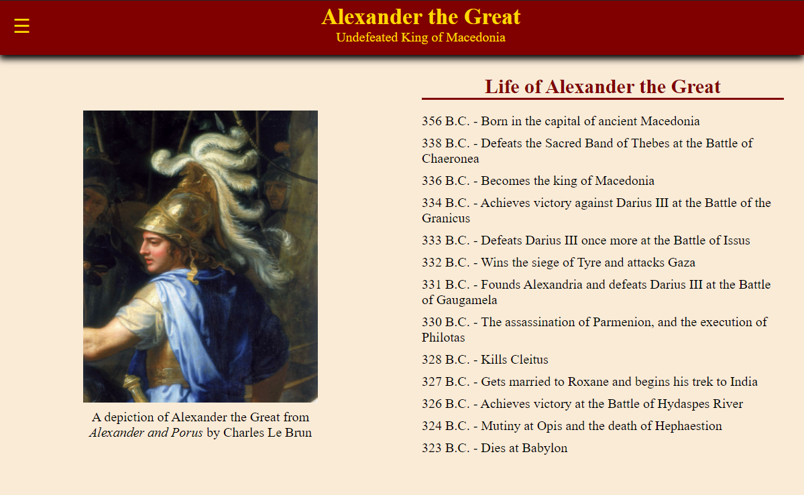

# alexander-tg-tribute

## Description
This is a tribute page to Alexander the Great.

The web page begins with a header that includes his name and a small tagline, as well as a navigation bar button that, upon click, brings in a navigation menu from the left side of the screeen. It is set up to take up 100% of the page on devices with widths smaller than 800px and then take 350px on widths larger than 800px. Clicking a link or off of the menu causes it to minimize. It links to the major sections and events. There is also a return-to-top button on devices over 800px in width.

The next segment of the web page includes a picture and caption combo and a timeline, which share a container. These are stacked on top of one another on devices with widths below 800px, but the flex-container puts them side by side on widths above 800px.

Following that is a major event section with more detail on each segment of his life.

Lastly are a legacy section that speaks about some of the reasons he could be considered "the Great" and a footer with links to sites with more information.

It is deployed at: https://spencerhulse.github.io/alexander-tg-tribute/